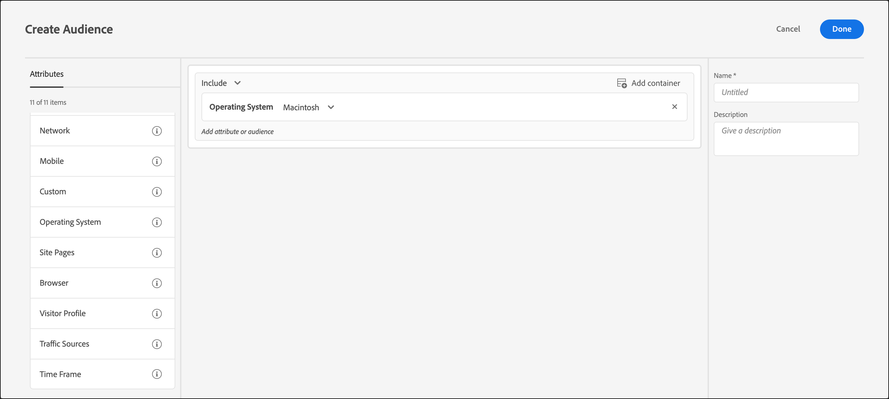

# Operating System

You can target visitors using [!DNL Adobe Target] who use a certain operating system.

1. In the [!DNL Target] interface, click **[!UICONTROL Audiences]** > **[!UICONTROL Create Audience]**. 
1. Name the audience and add an optional description. 
1. Drag and drop **[!UICONTROL Operating System]** into the audience builder pane.
1. Click **[!UICONTROL Select]**, then select one of the following options:

    * Linux 
    * Macintosh 
    * Windows

1. (Optional) Set up additional rules for the audience. 
1. Click **[!UICONTROL Done]**.

The following illustration shows an audience targeting visitors using a Macintosh OS.

## Training video: Creating Audiences

This video includes information about using audience categories.

* Create audiences 
* Define audience categories

>[!VIDEO](https://video.tv.adobe.com/v/17392)
