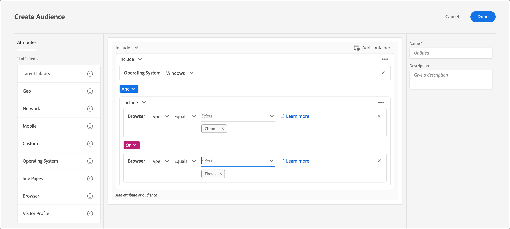
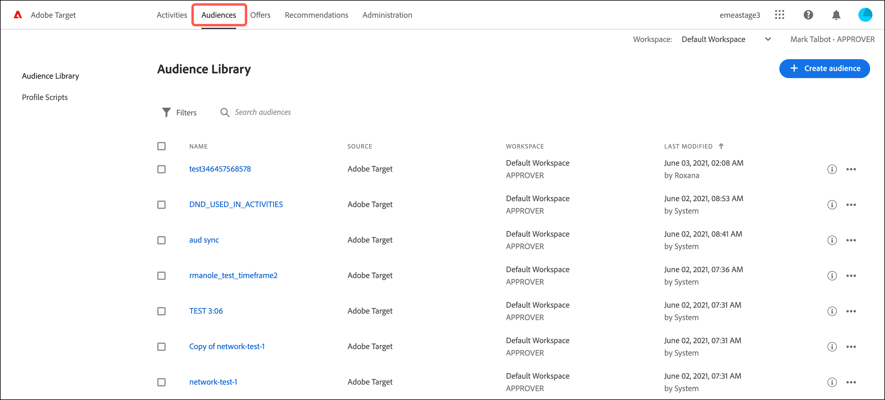
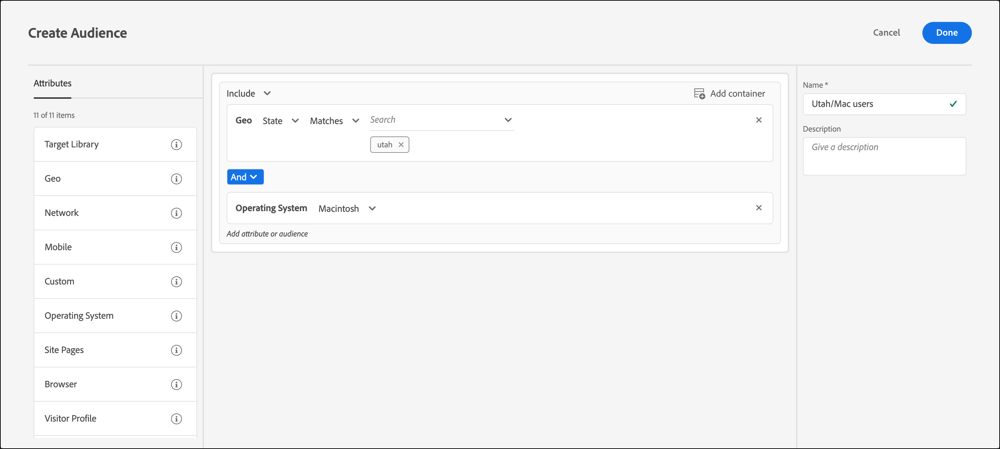

# Build audiences in [!DNL Target]

You can create customized audiences and save them to the [!DNL Adobe Target] [!UICONTROL Audiences] library for use in your activities. You can copy an existing audience that you can then edit to create a similar audience and combine multiple audiences.

## Audience overview

Audiences are defined by rules that determine who is included or excluded from a [!DNL Target] activity. An audience definition can include multiple rules and each rule can include multiple parameters. Complex audience definitions use the boolean operators AND and OR to combine rules and parameters to give you detailed control over which site visitors are counted as activity entrants.

When you combine rules or parameters with AND, any potential audience member must meet *all* of the defined conditions to be included as an entrant. For example, if you define an OS rule AND a browser rule, only visitors using both the defined OS *and* the defined browser are included in the activity.

When you combine rules or parameters with OR, any potential audience member need only meet any single defined condition to be included as an entrant. For example, if you define multiple mobile rules connected by OR, visitors meeting *any* of the defined criteria are included in the activity.

You can mix both boolean operators to create complex rules; however, operators at the same rule level must match. The user interface automatically applies the correct operator.

For example, the following rule targets visitors who use either Chrome *or* Firefox on a Windows computer:

>[!NOTE]
>
>Be careful to avoid creating rules that exclude all potential audience members. For example, it is not possible for someone to visit a page using Chrome *and* Firefox simultaneously.

## Create a new audience

1. Click **[!UICONTROL Audiences]** in the top menu bar.

   

1. From the [!UICONTROL Audiences] list, click **[!UICONTROL Create Audience]**.

   Or

   To copy an existing audience, from the [!UICONTROL Audiences] list, click the **[!UICONTROL More Actions]** icon (the ellipsis icon), then click **[!UICONTROL Duplicate]**. You can then edit the audience to create a similar audience. 

1. Type a unique, descriptive audience name and an optional description.
1. Drag and drop the desired attributes from the **[!UICONTROL Attributes]** list on the right to the audience builder pane.

   

   Each rule type has its own parameters. See [Categories for Audiences](/help/c-target/c-audiences/c-target-rules/target-rules.md#concept_E3A77E42F1644503A829B5107B20880D) for more information on configuring each type of audience rule.

1. Define the rule parameters.

   For example, the following audience targets visitors from Utah using the Macintosh operating system.

   

1. (Conditional) Continue adding and defining the desired attributes.

1. Click **[!UICONTROL Done]**.

   Newly created audiences appear in the list after a few seconds of processing delay. If the audience does not display immediately in the list, try searching for the audience or refresh the list. 

## Training video: Creating Audiences 

This video includes information about creating audiences.

* Create audiences 
* Define audience categories

>[!VIDEO](https://video.tv.adobe.com/v/17392)
