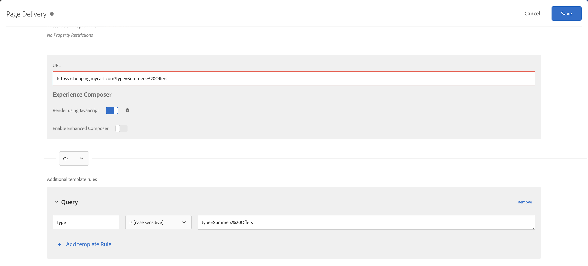

# Troubleshoot content delivery

If your page does not display the expected content, there are a few steps you can take to debug content delivery.

* Check your activity or campaign code carefully. A typo or other error could cause the expected content not to display. 
* Use mboxTrace or mboxDebug to troubleshoot the [!DNL Target] request. 
* Use the Adobe Experience Cloud Debugger, an easy-to-use tool that provides much of the same information as mboxDebug, to troubleshoot the [!DNL Target] request.

mboxDebug is especially useful when you are setting up [!DNL Target] on your page to make sure that the Target request is firing and the cookie is being set. However, it does not go into the kind of detail that is useful when debugging content delivery. If your activity does not appear on your page or undesired content appears, use mboxTrace to examine and debug the page in detail.

## Retrieve the authorization token to use with debugging tools {#section_BED130298E794D1FA229DB7C3358BA54}

Because mboxTrace and mboxDebug can expose campaign data and profile data to external parties, an authorization token is required. The authorization token can be retrieved in the [!DNL Target] UI. The token is valid for six hours.

You must have one of the following user permissions to generate an authentication token:

* At least [!UICONTROL Editor] permission (or [!UICONTROL Approver])

  For more information for [!DNL Target Standard] customers, see [Specify roles and Permissions](/help/main/administrating-target/c-user-management/c-user-management/user-management.md#roles-permissions) in *Users*. For more information for [!DNL Target Premium] customers, see [Configure enterprise permissions](/help/main/administrating-target/c-user-management/property-channel/properties-overview.md).

* Admin role on the workspace/product profile level

  Workspaces are available to [!DNL Target Premium] customers only. For more information, see [Configure enterprise permissions](/help/main/administrating-target/c-user-management/property-channel/properties-overview.md).

* Admin Rights (Sysadmin permission) on the [!DNL Adobe Target] product level

To retrieve the authorization token:

1. Click **[!UICONTROL Administration]** > **[!UICONTROL Implementation]**. 
1. From the Debugger Tools section, click **[!UICONTROL Generate New Authentication Token]**.

   

1. Add the generated token as a parameter to your URL to enable one of the advanced debugging tools.

   

## mboxTrace {#section_256FCF7C14BB435BA2C68049EF0BA99E}

mboxTrace enables you to receive trace information attached to [!DNL Target] responses. Trace information reflects the outcome of a [!DNL Target] call (for example, a conversion or an impression) and any additional data that may help in determining why this particular outcome happened, such as a set of available branches among which the selection was made in a campaign. Use this information to debug content delivery.

The following parameters are available:

| mboxTrace Options | Outcome |
|--- |--- |
|`?mboxTrace=console`|Prints into console log as objects.<br>For at.js, instead of popping a new browser window or outputting to the console as was in  mbox.js (now deprecated), you need to inspect the Network request and look under Preview (Chrome) or Response (Firefox).|
|`?mboxTrace=json`|Prints into console log as a literal JSON string|
|`?mboxTrace=window`|Prints into a popup window as a JSON string|
|`?mboxTrace=disable`|Turns off tracing session mode|

**Example mboxTrace call**

`https://www.mysite.com/page.html?mboxTrace=window&authorization=f543abf-0111-4061-9619-d41d665c59a6`

The output displays detailed information about your content. mboxTrace shows details about your campaign or activity and profile. It also provides a snapshot of the profile before execution, and a snapshot of what changed after execution. It also shows which campaigns or activities were evaluated for each location.

Some of the information includes matched and unmatched segment and target IDs:

* **SegmentId**: The IDs of segments, either from the reusable segments library or anonymous ones created for the particular campaign. 
* **TargetId**: The IDs of targets, either from the target expression library or anonymous targets for any segments from campaign. 
* **Unmatched**: The request did not qualify in this call for those segments or targets. 
* **Matched**: The request qualified for the specified segments or targets.

**Using mboxTrace on recommendations pages**: Adding mboxTrace as a query parameter on pages with recommendations replaces the Recommendations design on the page with an mboxTrace details window, which displays in-depth information about your recommendations, including:

* Recommendations returned vs. recommendations requested 
* The key used, and if it is generating recommendations 
* Criteria-generated recommendations vs. backup recommendations 
* Criteria configuration 
* Exclusions and inclusions applied 
* Collection rules

You do not need to include `=console`, `=json`, or `=window` in the query parameter. When you are done with the mboxTrace details, add `=disable` and press **[!UICONTROL Enter]** to return to the normal display mode.

The normal functioning and appearance of your site is not affected by mboxTrace. Visitors see your regular Recommendations design.

## mboxDebug {#mboxdebug}

To use mboxDebug, append an mboxDebug parameter to the end of your URL. The following table contains information about [!DNL Target] response-related URL parameters.

>[!NOTE]
>
>Some mboxDebug parameters are available with or without authentication.

| URL Parameters | Purpose |
|--- |--- |
|`mboxDebug=1`|Debugger<br>Adding this parameter to any URL with Target requests defined opens a pop-up window with valuable debugging details. Cookie information, PCid and Session ID values are written out, and all of the URLs are visible. Click on a Target request URL to show the response for that [!DNL Target] request. More details are available in [mbox_debug.pdf](/help/main/assets/mbox_debug.pdf).|
|`mboxDisable=1`|Disable mboxes on the page|
|`mboxOverride.browserIp=<Insert IP address>`|Test geotargeting<br>Test geotargeting with this URL parameter. Type an IP address as the value for this attribute, and Test&Target's geotargeting evaluates that IP address to match against any geotargeting or segmentation set in a campaign.|

>[!NOTE]
>
>Ensure that the URL fragment is after query string parameters. Anything after the first `#` is a fragment identifier and causes debugging parameters not to function correctly.

## Adobe Experience Cloud Debugger {#section_A2798ED3A431409690A4BE08A1BFCF17}

The Adobe Experience Cloud Debugger makes it fast and easy to understand your Target implementation. You can quickly view your library configuration, examine requests to make sure your custom parameters are being passed correctly, turn on console logging, and disable all Target requests. Authenticate into the Experience Cloud and you can use the powerful MboxTrace tool to inspect your activity and audience qualifications as well as your visitor profile.

For more information, see the training videos below:

For more detailed information, see [Debug at.js using the Adobe Experience Cloud Debugger](https://developer.adobe.com/target/implement/client-side/target-debugging-atjs/target-debugging-atjs/){target=_blank}.

## Top sellers are not appearing in Recommendations {#section_3920C857270A406C80BE6CBAC8221ECD}

The *`SiteCatalyst: purchase`* call can't be used for Purchase algorithm traffic data. Use the *`orderConfirmPage`* call instead.

## Check activity priority {#section_3D0DD07240F0465BAF655D0804100AED}

Form-based activities created with [!DNL Target Standard/Premium] might collide with activities created in the [!DNL Target Classic] UI that have the same priority and use the same [!DNL Target] request.

## Custom code does not produce the expected results in Internet Explorer 8. {#section_FAC3651F19144D12A37A3E4F14C06945}

Target no longer supports IE 8.

## Target cookie does not get set {#section_77AFEB541C0B495EB67E29A4475DF960}

If your site has a sub domain, such as [!DNL us.domain.com], but you need the Target cookie set on [!DNL domain.com] (instead of [!DNL us.domain.com]), you must override the `cookieDomain` setting. For more information, see [targetGlobalSettings()](https://developer.adobe.com/target/implement/client-side/atjs/atjs-functions/targetglobalsettings/){target=_blank}.

## Target content flickers or is not shown if an element is also part of Adobe Experience Manager personalization. {#section_9E1DABEB75AB431FB9F09887E6DD07D3}

If a DOM element is part of Adobe Experience Manager (AEM) personalization targeting and a Target activity, Target content might flicker or not be shown.

To remedy this situation, you can disable AEM personalization on pages on which Target is running.

## Redirect and remote offers fail to deliver due to an invalid URL. {#section_7D09043B687F43B39DAEDF17D00375AC}

If the redirect or remote offer uses an invalid URL, it might fail to be delivered.

For redirect offers, the [!DNL Target] response can contain `/* invalid redirect offer URL */`

Or

For remote offers, the [!DNL Target] response can contain `/* invalid remote offer URL */`

You can check the [!DNL Target] response in the browser or using mboxTrace. See [https://tools.ietf.org/html/std66](https://tools.ietf.org/html/std66) for more information on valid URLs. 

## [!DNL Target] requests are not firing on my site.

at.js does not fire Target requests if you are using an invalid doctype. at.js requires the HTML 5 doctype.

## Ensure that [!DNL Target] activities handle URLs with query string parameters correctly. {#query-strings}

The [!UICONTROL Activity URL] determines the page that qualifies visitors for the activity and renders the activity experiences to users. When prompted during activity creation, typing the complete URL does not always ensure that the content is delivered on that site page, especially with URLs that contain query string parameters.

By default, the [!UICONTROL Visual Experience Composer] (VEC) opens the page that is specified in your [Visual Experience Composer settings](/help/main/administrating-target/visual-experience-composer-set-up.md). You can also specify a different page during activity creation.

To display a different page after the VEC opens, click the **[!UICONTROL Configure gear icon]** > select **[!UICONTROL Page Delivery]** > then specify the desired URL in the [!UICONTROL Activity URL] field. 


But what if the URL contains query string parameters? Will it work and show the personalized content? In this scenario, irrespective of your targeted audience, you can include template rules in addition to the base URL to define your query parameters.

The following options can be used to include additional template rules:

### Option 1: Replicate the URL and keep it in the template rule with the “contains” option.

This option ensures that this URL qualifies for the activity, but be aware that there are corner cases attached to it that can influence your reporting data with additional records to URLs that contains the base URL.

In this scenario, the URL is `https://shopping.mycart.com?type=Summers%20Offers` and additional template rules "contains" the same URL, separated by an OR operator:


### Option 2: Restrict the URL “contains” condition with only the query string.

The corner case discussed in the previous option is applied in this option, but here the conditional setup is limited to the query string only.

In this scenario, the URL is `https://shopping.mycart.com?type=Summers%20Offers` and additional template rules "contains" only the query string, separated by an OR operator:


### Option 3: Instead of targeting the complete URL, leverage a specific part of the URL.

In this scenario, the URL is `https://shopping.mycart.com?type=Summers%20Offers` and additional template rules specify a [!UICONTROL Query] with [!UICONTROL type] > [!UICONTROL is (case sensitive)] > type=Summers%20Offers, separated by an OR operator:



## Escaping double quotes in [!DNL Target] profile attribute value is not working as expected. {#escape}

When you send values containing double quotes in a [!DNL Target] profile attribute, you must double escape it as show below.

```
adobe.target.trackEvent({
    "mbox": "data-collection",
    "params":    {
        "profile.tagLine": "Escape \\\"Double Quotes\\\" like this."
    }
});
```

## Training videos

The following videos contain more information about the concepts discussed in this article.

### Add the Extension 

>[!VIDEO](https://video.tv.adobe.com/v/23114t2/)

### Basic Adobe Target Debugging 

>[!VIDEO](https://video.tv.adobe.com/v/23115t2/)

### Mbox Trace 

>[!VIDEO](https://video.tv.adobe.com/v/23113t2/)
