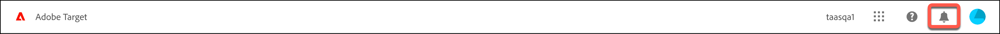
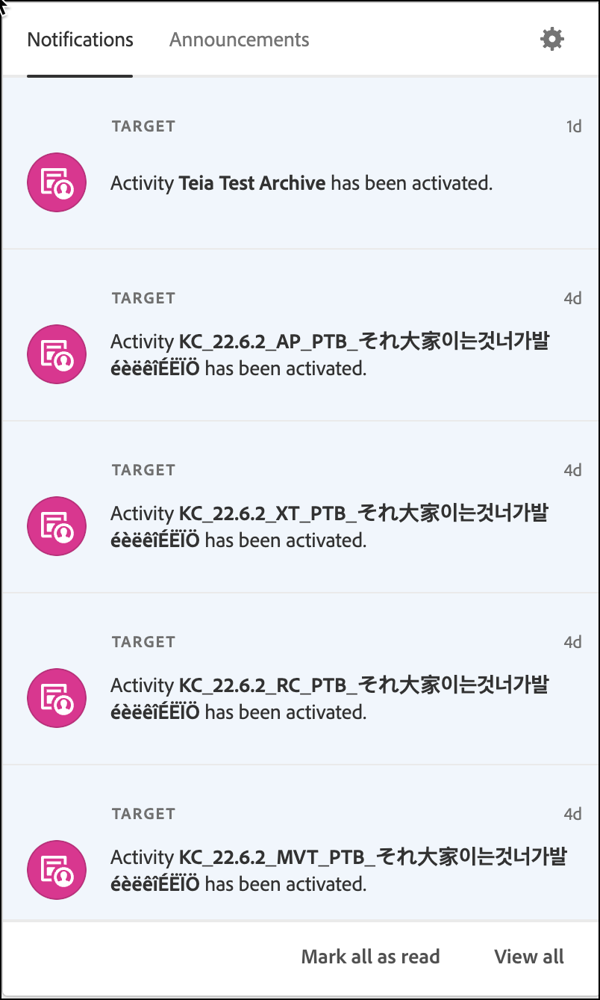

# Understand the [!DNL Target] UI

The user interface is arranged in a logical and user-friendly format to help you get the most out of [!DNL Adobe Target]. The following brief overview helps you get familiarized with [!DNL Target] and provides links for more in-depth information and step-by-step instructions.

The header at the top of the [!DNL Target] UI contains tabs and options to help you navigate the different capabilities of the solution. You can also switch organizations and [!DNL Adobe Experience Cloud] solutions, get help and notifications, manage your [!DNL Adobe] profile, and log out of [!DNL Target].

The tabs along the left side let you access the various capabilities of [!DNL Target], which is discussed later. Let's start by discussing the options on the right side before jumping into the tabs.

## Organizations

An *organization* is the entity that enables an administrator to configure groups and users, and to control single sign-on in the [!DNL Adobe Experience Cloud]. The organization functions like a log-in company that spans all the [!DNL Experience Cloud] products and solutions. Most often, an organization is your company name. However, a company can have many organizations.

Select the desired organization the [!UICONTROL Organization] drop-down list if your company has multiple organizations:

## Apps

The Apps switcher lets you quickly access the [!DNL Adobe Experience Cloud] solutions that you have access to.

## Help

The Help icon lets you access information, videos, blogs, and more to help you use [!DNL Target] more effectively. You can create a support ticket, find support telephone numbers, ask questions via Twitter, or provide feedback about [!DNL Target] to let us know how the [!DNL Target] team is doing.

## Notifications and announcements

The [!UICONTROL Notifications] and [!UICONTROL Announcements] panels help keep you up to date about all things [!DNL Adobe Target]. Proactive notifications help keep you abreast of the status of [!DNL Adobe Experience Cloud] solutions and [!DNL Target] events. Proactive announcements alert you to outage events and maintenance events.

>[!NOTE]
>
>The information about the enhanced [!UICONTROL Notifications and Announcements] panel in this section currently applies to select [!DNL Target] customers and will be rolled out to all customers in the coming months.

Click the bell icon from the header to view notifications:

The panel contains tabs for [!UICONTROL Notifications] and [!UICONTROL Announcements].

The following sections contain information about each tab, and how to configure notifications and announcements.

### Notifications

[!DNL Target] event notifications include the following:

* **Activities**: Notifications for all activity types when an activity is approved or deactivated, either manually or when it reaches its start or end date. The notification includes the name of the activity with a link to the activity's overview page.

  Notifications are configurable and are received, by default, by product admins, publishers, and approvers in the activity's workspace for [!DNL Target Premium] accounts. For [!DNL Target Standard] accounts, notifications are received by all publishers and approvers.

  Notifications are formatted like the following samples:

  * `Activity {target.activity.name} has been activated`
  
  * `Activity {target.activity.name} has been deactivated`

* **Profile scripts**: Notifications when a profile script is activated or deactivated, either manually or by [!DNL Target].

  Notifications are configurable and are received, by default, by product admins and approvers for both [!DNL Target Premium] and [!DNL Target Standard] accounts.

  Notifications are formatted like the following samples:

  * `Profile Script {target.profileScript.name} has been activated`
  * `Profile Script {target.profileScript.name} has been deactivated`

* **Recommendations feeds**: Notifications when a [!DNL Recommendations] feed is activated or deactivated, either manually or by [!DNL Target]. Notifications are also sent when a [!DNL Recommendations] feed fails.

  Notifications are configurable and are received, by default, by product admins and approvers for [!DNL Target Premium] accounts. [!DNL Recommendations] is a [!DNL Target Premium] feature and is not available in [!DNL Target Standard].

  Notifications are formatted like the following samples:

  * `Feed  {target.feed.name} has been activated`
  * `Feed {target.feed.name} has been deactivated`
  * `Feed {target.feed.name} has failed to import from source`

You can mark all notifications as read or view all notifications at the bottom of the panel.

### Announcements

Proactive announcements alert you to outage events and maintenance events.

More in-depth information can be found on the [Adobe Status](https://status.adobe.com/) page.

### Configure notifications and announcements

To edit your notifications preferences:

1. Click the gear icon, then click **[!UICONTROL Notifications]**.
1. Under **[!UICONTROL Target]**, click **[!UICONTROL Customize]**.
1. Select or deselect the categories for which you want to receive notifications:

   * Requests: When someone sends you a request to approve an object or to grant access to an object. You cannot unsubscribe from this category.
   * Assigned to me: When someone assigns an object to you.
   * Mentions: When someone mentions you in a comment.
   * New releases: When a new release is available for a product or a service that you have access to. 
   * Shared with me: When someone shares an object with you.
   * Updates on content: When someone edits, deletes, or comments on an object you created or follow.
   * Others:

1. Select the categories that you want to be considered high priority.
1. Select the notifications for which you would like to see alerts display in your browser. 

   These alerts appear in the top-right corner of your browser for a few seconds. You can choose to see high-priority categories, all categories, or to hide all notification pop-ups. You can also configure if you want the notifications to remain visible until you dismiss them or you can configure the notification duration.

1. Select the frequency at which you want to receive notification emails:

   * Don't send emails
   * Instant notifications
   * Daily digest
   * Weekly digest

## Profile

Click your profile avatar to edit your [!DNL Adobe Experience Cloud] preferences or to sign out of [!DNL Target]. You can also access or edit your [!DNL Adobe] profile.

Now let's discuss the tabs along the left side of the [!DNL Target] header.

## Activities

The **[!UICONTROL Activities]** list is the default view when you open [!DNL Target]. You can create activities from this page and manage existing activities.

See [Activities](/help/main/c-activities/activities.md) for in-depth information about the activity types available in [!DNL Target] and to learn more about the [!UICONTROL Activity] list's user interface.

## Audiences

Click the **[!UICONTROL Audiences]** tab to display the [!UICONTROL Audiences] list where you can create audiences and manage existing audiences.

An audience is a group of similar activity entrants who see a targeted activity. An audience is group of people with the same characteristics, such as a new visitor, a returning visitor, or returning visitors from the Midwest. The [!UICONTROL Audience] feature allows you to target different content and experiences to specific audiences to optimize your digital marketing by displaying the right messages to the right people at the right time. If a visitor is identified as part of a target audience, [!DNL Target] determines which experience to display, based on criteria defined during activity creation.

See [Create audiences](/help/main/c-target/c-audiences/create-audience.md) for in-depth information about the audience types in [!DNL Target] and to learn more about the [!UICONTROL Audience] list's user interface.

## Offers

Click the **[!UICONTROL Offers]** tab to display the [!UICONTROL Offers] list where you can create experiences and offers and manage existing experiences and offers.

An experience can be an offer, image, text, button, video, combination of these various elements on a page, an entire web page, or a set of pages that perhaps form a purchase funnel or some other logical sequence of pages. It can also be the response of a voice assistant, a customer service script, or even a personalized flavor from a drink machine. You test or personalize experiences in [!DNL Target] activities.

See [Offers](/help/main/c-experiences/c-manage-content/manage-content.md) for in-depth information about the offer types in [!DNL Target] and to learn more about the [!UICONTROL Offer] list's user interface.

## Recommendations

Click the **[!UICONTROL Recommendations]** tab to access [!DNL Target Recommendations].

>[!NOTE]
>
>Recommendations activities are available as part of the [!DNL Target Premium] solution . They are not available in [!DNL Target Standard] without a [!DNL Target Premium] license. For more information, see [Target Premium](/help/main/c-intro/intro.md#premium) in *Introduction to Target*.

[!UICONTROL Recommendations] activities automatically display products or content that might interest your customers based on previous user activity or other algorithms. Recommendations help direct customers to relevant items that they might otherwise not know about.

See [Recommendations](/help/main/c-recommendations/recommendations.md) for in-depth information about [!UICONTROL Recommendations] in [!DNL Target] and to learn more about the [!UICONTROL Recommendations] user interface.

## Administration

Click the **[!UICONTROL Administration]** tab to access the [!UICONTROL Administration] pages.

The [!UICONTROL Administration] pages let you administer [!DNL Target], including configuration settings for the [!UICONTROL Visual Experience Composer] (VEC), reporting, [!DNL Scene7] configuration, implementation, hosts, environments, response tokens, and users.

See [Administer Target overview](/help/main/administrating-target/administrating-target.md) for in-depth information and to learn more about the user interface.
