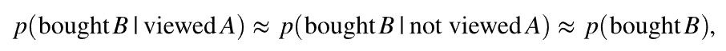
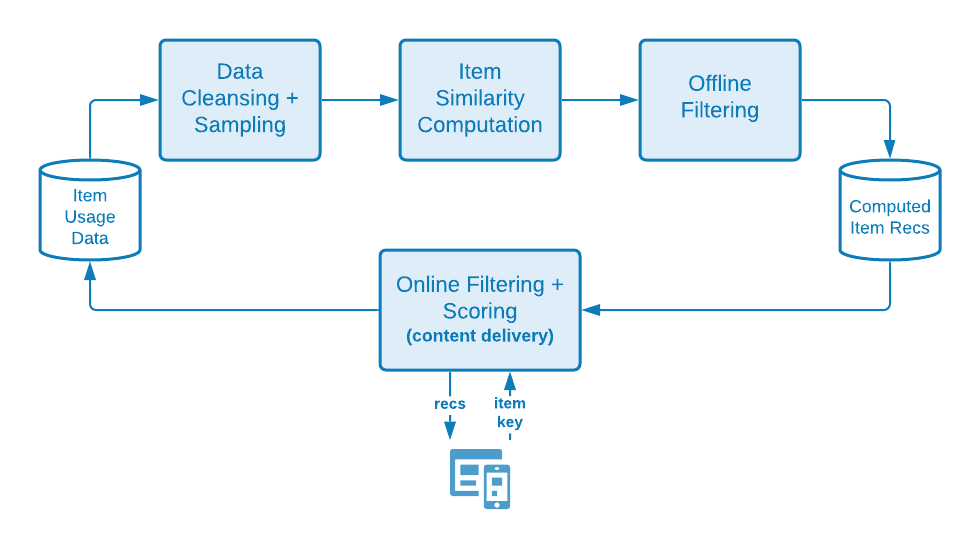
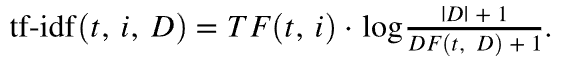
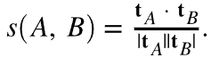
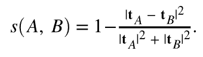

#  The science behind Target's recommendations algorithms

An in-depth description of the algorithms used in [!DNL Adobe Target Recommendations], including the logic and mathematical details of model training and the process of model serving.

Model training is the process of how recommendations are generated by the [!DNL Adobe Target] learning algorithms. Model serving is how [!DNL Target] delivers recommendations to your site visitors (also known as content delivery).

[!DNL Target] includes the following broad types of algorithms in [!DNL Recommendations]:

* **Item-Based algorithms**: Include algorithms that follow the logic "People who viewed/bought this item also viewed/bought these items." These algorithms are grouped under the umbrella term item-item collaborative filtering, as well as [!UICONTROL Items with Similar Attributes] algorithms.

* **User-Based algorithms**: Include the [!UICONTROL Recently Viewed] and [!UICONTROL Recommended for You] algorithms.

* **Popularity-Based algorithms**: Include algorithms that return the top-viewed or top-purchased items across the website, or top-viewed or top-purchased by category or item attribute.

* **Cart-Based algorithms**: Include multi-item based recommendations with the logic "people who viewed/bought these items, also viewed/bought those items."

* **Custom Criteria**: Include recommendations based on custom files uploaded to [!DNL Target].

>[!NOTE]
>
>For more general information about each algorithm type and the individual algorithms, see [Base the recommendation on a recommendation key](/help/main/c-recommendations/c-algorithms/base-the-recommendation-on-a-recommendation-key.md).

Many of the algorithms listed above are predicated on the presence of one or multiple keys. These keys are used to retrieve similar items at content delivery time (when recommendations are made). Customer-specified keys can include the current item someone is viewing, last item viewed or purchased, top-viewed item, current category, or favorite category for that visitor. Other algorithms, such as cart-based or user-based recommendations, use implicit keys (that cannot be configured by the customer). For more information, see *Recommendation keys*, in [Base the recommendation on a recommendation key](/help/main/c-recommendations/c-algorithms/base-the-recommendation-on-a-recommendation-key.md#keys). Note, however, that these keys are relevant at model serving time only (content delivery). These keys do not affect the "offline" or model training time logic.

The following sections group algorithms in a slightly different manner than the algorithm types described above. The following grouping is based on the similarity of model training logic.

## Item-Item collaborative filtering

Algorithms include:

* [!UICONTROL People Who Viewed This, Viewed That]
* [!UICONTROL People Who Viewed This, Bought That]
* [!UICONTROL People Who Bought This, Bought That]

Item-Item collaborative filtering recommendation algorithms are based on the idea that you should use the behavioral patterns of many users (hence collaborative) to provide useful recommendations for a given item (for example, filter the catalog of possible items to recommend). Although there are many different algorithms that fall under the general umbrella of [collaborative filtering](https://en.wikipedia.org/wiki/Collaborative_filtering), these algorithms universally use behavioral data sources as inputs. In [!DNL Target Recommendations], these inputs are the unique views and purchases of items by users.

For the "people who viewed/purchased this item also viewed/purchased these items" algorithm, the goal is to calculate a similarity s(A,B) between all pairs of items. For a given item A, the top recommendations are then ordered by their similarity s(A,B).

One example of such a similarity is the co-occurrence between items: a simple count of the number of users who purchased both items. Although intuitive, such a metric is naive in that it is biased towards recommending popular items. For example, if at a grocery retailer most people purchase bread, bread will have a high co-occurrence with all items, but it is not necessarily a good recommendation. [!DNL Target] instead uses a more sophisticated similarity metric known as the log likelihood ratio (LLR). This quantity is large when the probability of two items, A and B, co-occurring is very different to the probability of them not co-occurring. For concreteness, consider a case of the [!UICONTROL People Who Viewed This, Bought That] algorithm. The LLR similarity is large when the probability that B was purchased is *not* independent of whether someone viewed A.

For example, if

then item B should not be recommended with item A. Full details of this log likelihood ratio similarity calculation are provided [in this PDF](/help/main/c-recommendations/c-algorithms/assets/log-likelihood-ratios-recommendation-algorithms.pdf).

The logical flow of the actual algorithm implementation is shown in the following schematic diagram:

Details of these steps are as follows:

* **Input data**: Behavioral data, in the form of views and purchases of visitors collected when you [implement Target](https://developer.adobe.com/target/implement/recommendations/){target=_blank} or from [Adobe Analytics](/help/main/c-recommendations/c-algorithms/use-adobe-analytics-with-recommendations.md){target=_blank}.

* **Model training**:

  * **Data cleansing and sampling**: For algorithms with an N-day lookback, the behavioral data is first filtered to include only those N days of data. Collection rules and global exclusions are then applied to remove any items that should not be recommended. Finally, any visitors who interacted with more than 1,000 items have their usage data sampled to only 1,000 items.
  * **Item similarity computation**: This is the core computational step: calculating the log likelihood ratio similarity between all candidate item pairs, and ranking pairs of items by this similarity score.
  * **Offline filtering**: Finally, any further applicable dynamic filters are applied (for example, dynamic category exclusions). After this step, pre-computed recommendations are cached globally to be available for serving.

* **Model serving**: Recommendations content is delivered from [!DNL Target]'s [global "Edge" network](/help/main/c-intro/how-target-works.md#concept_0AE2ED8E9DE64288A8B30FCBF1040934). When mbox requests are made to [!DNL Target] and it is determined that recommendations content should be delivered to the page, the request for the appropriate [item key](/help/main/c-recommendations/c-algorithms/base-the-recommendation-on-a-recommendation-key.md#keys) for the recommendations algorithm is either parsed from the request or looked up from the user profile, and then used to retrieve the recommendations computed in the previous steps. Further dynamic filters are applied at this time, before the appropriate [design](/help/main/c-recommendations/c-design-overview/create-design.md) is rendered.

## Content similarity

Algorithm included: 

* [!UICONTROL Items with Similar Attributes]

In this type of algorithm, two items are considered to be related if their names and textual descriptions are semantically similar. Unlike most recommendations algorithms in which behavioral data sources must be used, content similarity algorithms use metadata from product catalogs to derive the similarity between items. [!DNL Target] is therefore able to drive recommendations in so-called "cold-start" scenarios, where no behavioral data has been collected (for example, at the beginning of a [!DNL Target] activity).

Although the model serving and content delivery aspects of [!DNL Target]'s content similarity algorithms are identical to other item-based algorithms, the model training steps are drastically different and involve a series of natural language processing and preprocessing steps as depicted in the following diagram. The core of the similarity calculation is the use of the cosine similarity of modified tf-idf vectors that represent each item in the catalog.

Details of these steps are as follows:

* **Input data**: As described before, this algorithm is based purely on catalog data (ingested to [!DNL Target] via a [Catalog Feed, the Entities API, or from on-page updates](https://developer.adobe.com/target/implement/recommendations/){target=_blank}.

* **Model training**:

  * **Attribute extraction**: After the application of regular static filters, catalog rules and global exclusions, this algorithm extracts relevant textual fields from the entity schema. [!DNL Target] automatically uses the name, message, and category fields from the entity attributes and attempts to extract any string fields from custom [entity attributes](/help/main/c-recommendations/c-products/entity-attributes.md). This process is done by ensuring that the majority of values for that field are not parsable as a number, date, or boolean.
  * **Stemming and stop-word removal**: For more accurate text similarity matching, it is prudent to remove very common "stop" words that do not significantly alter the meaning of an item (for example, "was," "is," "and," and so forth). Similarly, stemming refers to the process of reducing words with different suffixes to their root word, which has an identical meaning (for example, "connect," "connecting," and "connection" all have the same root word: "connect"). [!DNL Target] uses the Snowball stemmer. [!DNL Target] performs automatic language detection first, and can do stop word removal for up to 50 languages and stemming for 18 languages.
  * **n-gram creation**: After the previous steps, each word is treated as a token. The process of combining contiguous sequences of tokens into a single token is referred to as n-gram creation. [!DNL Target]'s algorithms consider up to 2-grams.
  * **tf-idf computation**: The next step involves the creation of tf-idf vectors to reflect the relative importance of tokens in the item description. For each token/term t in an item i, in a catalog D with |D| items, the term frequency TF(t, i) is computed first (the number of times the term appears in the item i), as well as the document frequency DF(t, D). In essence, the number of items where the token t exists. The tf-idf measure is then

    

    [!DNL Target] uses Apache Spark's *tf-idf* featurization implementation, which under the hood hashes each token to a space of 218 tokens. In this step, customer-specified attribute boosting and burying is also applied by adjusting the term frequencies in each vector based on settings specified in the [criteria](/help/main/c-recommendations/c-algorithms/create-new-algorithm.md#similarity). 
    
  * **Item similarity computation**: The final item similarity computation is done using an approximate cosine similarity. For two items, *A* and *B*, with vectors tA and tB, the cosine similarity is defined as:

    

    To avoid significant complexity in computing similarities between all N x N items, the *tf-idf* vector is truncated to contain only its largest 500 entries, and then compute cosine similarities between items using this truncated vector representation. This approach proves to be more robust for sparse vector similarity computations, as compared to other approximate nearest neighbor (ANN) techniques, such as locality sensitive hashing.

  * **Model serving**: This process is identical to item-item collaborative filtering techniques described in the previous section.

## Multi-key recommendations

Algorithms include:

* Cart-Based recommendations
* [!UICONTROL Recommended For You]

The most recent additions to the [!DNL Target] suite of recommendations algorithms are [!UICONTROL Recommended For You] and a series of Cart-Based recommendations algorithms. Both types of algorithms use collaborative filtering techniques to form individual item-based recommendations. Then, at serve-time, multiple items in the user's browsing history (for [!UICONTROL Recommended For You]), or the user's current cart (for Cart-based recommendations) are used to retrieve these item-based recommendations, which are then merged to form the final list of recommendations. Note that many flavors of personalized recommendation algorithms exist. The choice of a multi-key algorithm means that recommendations are immediately available after a visitor has any browsing history and recommendations can update to respond to the latest visitor behavior.

These algorithms build on the foundational collaborative filtering techniques described in the item-based recommendations section, but also incorporate hyperparameter tuning to determine the optimal similarity metric between items. The algorithm performs a chronological split of behavioral data for each user, and trains recommendation models on the earlier data while attempting to predict the items that a user views or purchases later. The similarity metric that produces the optimal [Mean Average Precision](https://en.wikipedia.org/wiki/Evaluation_measures_(information_retrieval)#Mean_average_precision) is then chosen.

The logic of model training and scoring steps are shown in the following diagram:

Details of these steps are as follows:

* **Input data**: This is identical to item-item collaborative filtering (CF) methods. [!UICONTROL Both Recommended For You] and Cart-Based algorithms use behavioral data, in the form of views and purchases of users collected when you [implement Target](https://developer.adobe.com/target/implement/recommendations/){target=_blank} or from [Adobe Analytics](/help/main/c-recommendations/c-algorithms/use-adobe-analytics-with-recommendations.md){target=_blank}.

* **Model training**: 

  * **Data cleansing and sampling**: This is again the same as for collaborative filtering methods, where the lookback window is applied to filter behavioral data to an appropriate date range, followed by application of catalog rules and global exclusions. Visitors who have interacted with more than 1,000 items have only their most recent 1,000 usages considered.
  * **Train test split**: Perform a chronological split of the usages for each user, allocating the first 80% of their usages to training data, with the remaining 20% allocated to the test data.
  * **Item similarity model training**: The core item similarity computation differs for [!UICONTROL Recommended For You] and Cart-Based algorithms in the way that candidate item vectors are constructed. For [!UICONTROL Recommended For You], the item vectors have dimension NUsers, where each entry represents the sum of implicit ratings for that user of the item--purchases of an item are given a weight of 2x that of views of the item. For Cart-Based recommendations, the item vectors have binary entries; if within-session behavior is to be considered only, there is a new entry for every session. Otherwise, there is an entry in this item vector for every visitor.

  The training step computes several types of vector similarities: LLR similarity ([discussed here](/help/main/c-recommendations/c-algorithms/assets/log-likelihood-ratios-recommendation-algorithms.pdf)), cosine similarity (defined previously), and a normalized L2 similarity, defined as:

  

  * **Item similarity model evaluation**: The model evaluation is done by taking the recommendations generated in the previous step and making predictions on the test data set. The online scoring phase is mimicked by chronologically ordering each user's item usages in the test dataset, then making 100 recommendations for ordered subsets of items in an attempt to predict subsequent views and purchases. An information retrieval metric, the [Mean Average Precision](https://en.wikipedia.org/wiki/Evaluation_measures_(information_retrieval)#Mean_average_precision), is used to evaluate the quality of these recommendations. This metric takes into account the order of recommendations, and favors relevant items higher up in the list of recommendations, which is an important property for ranking systems.
  * **Model selection**: After offline evaluation, the model that has the highest Mean Average Precision is selected, and all individual item-item recommendations computed for it.
  * **Offline filtering**: The final stage of model training is the application of any applicable dynamic filters. After this step, pre-computed recommendations are cached globally to be available for serving.

* **Model serving**: Unlike previous algorithms in which serving recommendations involve specifying a single key for retrieval, followed by application of business rules, the [!UICONTROL Recommended for You] and Cart-Based algorithms employ a more complex runtime process.

  * **Multi-key retrieval and merging**: For Cart-Based recommendations, up to ten items that are passed in the cart are considered as keys for retrieval and recommendations from each are weighted equally. For [!UICONTROL Recommended for You], up to the last five unique viewed items and last five unique purchased items are considered as keys for retrieval, with recommendations arising from purchased items weighted twice as much as recommendations arising from viewed items. When merging recommendations, if an item appears in multiple individual lists of recommendations, its weighted similarity scores are added. The final list of recommendations from this stage is then the merged list of re-weighted recommendations, ranked in descending order.
  * **Filtering**: Next, filtering rules such as removal of previously viewed and/or purchased items, as well as other dynamic business rules are applied.

These processes are illustrated in the following image, where a visitor has viewed item A and purchased item B. Individual recommendations are retrieved with the offline similarity scores shown beneath each item label. After retrieval, the recommendations are merged with weighted similarity scores summed. Finally, in a scenario where the customer has specified that previously viewed and purchased items must be filtered out, the filtering step removes items A and B from the list of recommendations.

## Popularity-Based

Algorithms include:

* [!UICONTROL Most Viewed Across the Site]
* [!UICONTROL Most Viewed by Category]
* [!UICONTROL Most Viewed by Item Attribute]
* [!UICONTROL Top Sellers Across the Site]
* [!UICONTROL Top Sellers by Category]
* [!UICONTROL Top Sellers by Item Attribute]

[!DNL Target] provides popularity-based algorithms for both the most viewed items, as well as the top selling items either across a website, or broken down by an item attribute or category. Popularity based algorithms rank items based on the number of sessions in which that item was viewed or purchased in a given time frame.

All these algorithms combine aggregated behavioral data where the total number of sessions in which items were viewed and purchased is recorded at both hourly and daily resolutions. Individual algorithms then find the most viewed or most purchased items for the customer configured lookback window.

Individual algorithm nuances are as follows:

* [!UICONTROL Most Viewed Across the Site] and [!UICONTROL Top Sellers Across the Site] rank items by the aggregate counts of sessions in which these items were viewed or purchased respectively. The output is a single (key-less) list of recommended items.
* Most Viewed/Top sellers by Category/Item Attribute are recommendations where items are ordered by the aggregate counts of sessions in which these items were viewed or purchased, but grouped by the item category or specific item attribute. The outputs are lists of recommended items, keyed by values of categories, or values of item attributes.

## Recently Viewed

The "recently viewed" recommendations algorithm allows for in-session personalization of recommendations. This algorithm requires no offline "model training." Instead, [!DNL Target] uses the unique [Visitor Profile](/help/main/c-target/c-visitor-profile/visitor-profile.md) to maintain a running list of items that have been viewed in a given session and can surface these items in recommendations activities. This allows for real-time updates to recommendations and next-page personalization.

## Custom criteria

Custom criteria allow customers to [upload their own recommendations to [!DNL Target]](/help/main/c-recommendations/c-algorithms/recommendations-csv.md), giving important flexibility and allowing "bring your own model" capabilities. Custom criteria replace the "offline training" portion of [!UICONTROL Item-Based] recommendations, but behave similarly to Item-Based recommendation algorithms during the online content delivery phase, in that a single key is used for retrieval of recommendations and business rules/filters are then applied.
