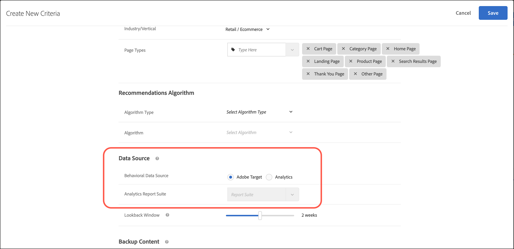

#  Use [!DNL Adobe Analytics] with [!DNL Recommendations]

Using [!DNL Adobe Analytics] as the behavioral data source lets clients use the view-based and/or purchase-based behavioral data from [!DNL Analytics] in [!DNL Adobe Target] [!DNL Recommendations] activities. This feature is especially helpful in situations where the [!DNL Target Recommendations] setup is new and [!DNL Analytics] has much historical data to use.

Using [!DNL Analytics] as the behavioral data source can act as a rich source of information about user behavior. This information might include data from a third-party source or feed that is shared only with [!DNL Analytics].

While [creating criteria](/help/main/c-recommendations/c-algorithms/create-new-algorithm.md) in [!DNL Recommendations], there are two radio buttons that let you choose which data source is to be used: [!UICONTROL mboxes] or [!UICONTROL Analytics]. To create a criteria, click [!UICONTROL Recommendations] > [!UICONTROL Criteria] > [!UICONTROL Create Criteria] > [!UICONTROL Create Criteria]. For more information, see [Create criteria](/help/main/c-recommendations/c-algorithms/create-new-algorithm.md).

>[!NOTE]
>
>If these two buttons do not display in your account, reach out to [Customer Care](/help/main/cmp-resources-and-contact-information.md#reference_ACA3391A00EF467B87930A450050077C).

## Use Cases for Analytics data in Target

Using [!DNL Analytics] as the behavioral data source for recommendations also lets you deploy specific use cases without the requirement of tagging entity pages with all the [!DNL Target] entity parameters. Although that requires certain pre-requisites to be in place, availability of "Product Variables" is the most important thing for that functionality to work seamlessly. Regular eVars and Props are not sufficient for this handshake to happen automatically between [!DNL Analytics] and [!DNL Target].

You can use [!DNL Analytics] as the behavioral data source to:

* Display recommendations on a retail site to users on a product detail page, based on what other users purchased from the same category in the last month, using [!DNL Analytics] data.
* Display content on the home screen of a media site for the most popular content in a particular category that is currently trending, based on [!DNL Analytics] data.

## Implementation in [!DNL Analytics]

The following sections help you implement this feature on the [!DNL Analytics] side.

### Prerequisites: set up product variables in [!DNL Analytics]

Implement product variables in [!DNL Analytics] with the necessary attributes that are required for [!DNL Target Recommendations]. 

A [!DNL Target Recommendations] sample feed format acts as guide on which all attributes must be defined in the product variables. Later those values must be "mapped" within the [!DNL Target] UI for the respective [!DNL Target] entity values.

>[!NOTE]
>
>If it is a content site, the respective content pieces must be treated as "products" and associated attributes about that content must be passed as attributes. Such attributes can include author name, publish date, content title, month of release, and so forth. Granularity of category level, or category types, should be decided by the business based on use-case requirements.
  
For more details on how to set up product variables, see [products](https://experienceleague.adobe.com/docs/analytics/implementation/vars/page-vars/products.html) in the *Implement Adobe Analytics* guide. Some of the notes in that documentation need discretion of the team who is deploying it (example : Category). It is always advised to consult with [!DNL Adobe] before doing this activity.

### Considerations

[!DNL Analytics] data is sent via a daily feed. Behavioral results can take up to 24 hours to be reflected within recommendations results on your site. As with all [!DNL Recommendations] criteria settings, this data source can and should be tested.

For quick decision making on which data source is to be used, if there is much organic data generated every day by users, and not much dependency required on historic data, then using a [!DNL Target] mbox as the behavioral data source can be a good fit. In cases of less availability of organic data generated recently, if you want to bank upon [!DNL Analytics] data, then the using [!DNL Analytics] as the behavioral data source is a good fit.

Now it is time to map these variables on [!DNL Target] side for continuous supply of behavioral data.

## Implement in [!DNL Target]

1. In [!DNL Target], click **[!UICONTROL Recommendations]**, then click the **[!UICONTROL Feeds]** tab.

   

1. Click **[!UICONTROL Create Feed]**.

1. Select **[!UICONTROL Analytics Classifications]**, then specify the report suite.

   

1. Click **[!UICONTROL Next]** to advance to the **[!UICONTROL Schedule]** settings, the select a frequency period for the feed:

   * [!UICONTROL Daily]
   * [!UICONTROL Weekly]
   * [!UICONTROL Every 2 weeks]
   * [!UICONTROL Never]

   You can also select the time of day for the feed to process.

1. Click **[!UICONTROL Next]** to advance to the  **[!UICONTROL Mapping]** settings, then map the field column headers to the appropriate [!UICONTROL Recommendations] field names.

   

1. Click **[!UICONTROL Save]**.

## Frequently Asked Questions

Consider the following FAQs as you use [!DNL Analytics] with [!DNL Target]:

### Are the `entity.id` and `entity.categoryId` values required to be passed within the [!DNL Target] mbox call?

Yes, those two values are still required. The rest of the attributes can be passed via an [!DNL Analytics] feed, as discussed in this document.

### Can I use dynamic inclusion rules, such as entity parameter matches profile attributes using the [!DNL Analytics] feed approach?

Yes, you can. The method is similar when using [!DNL Target] stand-alone. In this case, however, you must be mindful about the timing factor. The entity variables that are supposed to match with the profile variables depend on the data layer that might appear much later on the page.
