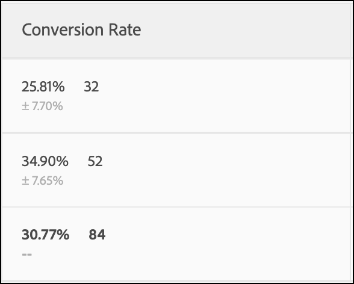
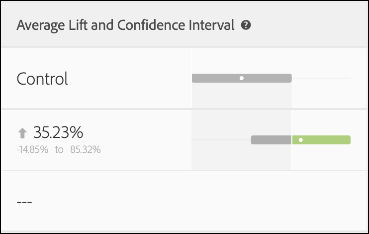
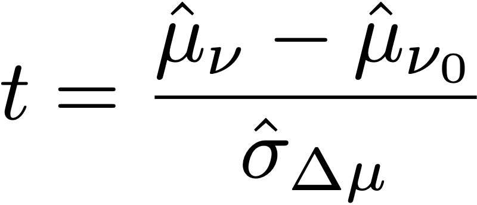
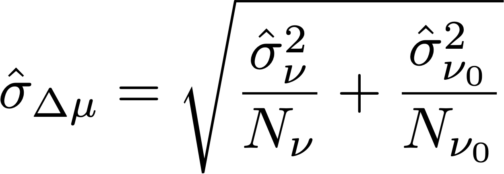

# Statistical calculations in A/Bn tests

This page documents the detailed statistical calculations used in manual A/Bn tests in [!DNL Adobe Target]. Definitions are provided for Conversion Rate, Confidence Interval of Conversion Rate, Lift, Confidence Interval for Lift, and Confidence. 

<p style="text-align:center;"></p>

## Mean performance

### Conversion Rate and Revenue Per Visitor (RPV) Campaigns

The following illustration shows Conversion Rate, Confidence Interval of Conversion Rate, and the number of Conversions in a [!DNL Target] report. For example, the first line shows that for Experience A: the conversion rate is 25.81% with a Confidence Interval of ±7.7% and 32 conversions were recorded. Given that 124 Visitors saw the experience, this equates to 32/124 = 25.81%.

<p style="text-align:center;"></p>

The conversion rate or **mean**, *μ<sub>ν</sub>*, for each experience *ν* in an experiment is defined as a ratio of the sum of the metric to the number of units assigned to that metric, *N<sub>ν</sub>*:

<p style="text-align:center;"></p>

Here, 

* *Y<sub>iν</sub>* is the value of the metric for each unit *i*, that has been assigned to a given experience *ν*.

* The sum over units *i* depends on the choice of counting methodology.

    * If *Visitors* is used as the counting methodology, each unit is a unique visitor defined as a unique participant in the activity for the life of the activity.
    * If *Visits* is used as the counting methodology, each unit is a unique visit defined as a unique participant in an experience during a [!DNL Target] session (with a unique `sessionId`). When the `sessionId` changes, or the visitor reaches the conversion step, a new visit is counted.
    * If *Activity Impressions* is used as the counting methodology, each unit is a unique impression defined as each time a visitor loads any page of the activity.

## Confidence Interval of Mean/Conversion Rate

The confidence interval of the conversion rate is intuitively defined as range of possible conversion rates that is consistent with the underlying data. 

When running experiments, the conversion rate we observe for a given experience is an _estimate_ of the "true" conversion rate. To quantify the uncertainty in this estimate, we can use a confidence interval. [!DNL Target] always reports a 95% confidence interval, which means that in the long run, 95% of confidence intervals calculated include the true conversion rate of the experience. 

A 95% confidence interval of conversion rate *μ<sub>ν</sub>* is defined as the range of values:

<p style="text-align:center;"></p>

where the standard error for the mean is defined as

<p style="text-align:center;"></p>

where an unbiased estimate of the sample standard deviation is used:

<p style="text-align:center;"></p>

Note that when the campaign is a conversion rate campaign (i.e., the conversion metric is binary), the standard error reduces to:

<p style="text-align:center;"></p>

## Lift

The following illustration shows Lift and Confidence Interval of Lift in a [!DNL Target] Report. The number represents the average of the range of the lift bounds, and the arrow reflects if the lift is positive or negative. The arrow displays in grey until the confidence passes 95%. After confidence passes the threshold, the arrow is green or red based on a positive or negative lift. 

<p style="text-align:center;"></p>

The lift between a experience  *ν*, and the control experience *ν<sub>0</sub>* is the relative "delta" in conversion rates, defined as 

<p style="text-align:center;"></p>

where the individual conversion rates are as defined above. More simply, 

```
Lift(Experience N) = (Performance_Experience_N - Performance_Control)/ Performance_Control
```

If conversion rate of the control experience *ν<sub>0</sub>* is 0, there is no lift. 

## Confidence Interval of Lift

The boxplot graph in the [!UICONTROL Average Lift and Confidence Interval] column represents the average value and 95% Confidence Interval of Lift. The boxplot is grey when there is any overlap in the confidence interval of a given non-control experience with the confidence interval of control experience, and is in green or red when the range of given experience's confidence interval is above or below the confidence interval of control experience.

The standard error of the lift between a experience  *ν*, and the control experience  *ν<sub>0</sub>* is defined as:

<p style="text-align:center;"></p>

Then the 95% Confidence Interval of the lift is:

<p style="text-align:center;"></p>

This calculation uses the "Delta" method, and is described [in more detail in this document](/help/main/assets/confidence_interval_lift.pdf)

## Confidence

The last column shows the confidence in a [!DNL Target] report. The confidence of an experience is a probability (denoted as a percentage) of obtaining a result less extreme than the one that is actually observed given the null hypothesis is true. In terms of p-values, the confidence displayed is *1 - p-value*. Intuitively, higher confidence means that it is less likely that the control and non-control experience have equal conversion rates. 

In [!DNL Target], a two-tailed **Welch's t-test** is performed between the test experience and the control experience to test if the means of test and control experiences are the same. Because we usually do not know if sample sizes and variances of two groups are the same before running the experiment, and [!DNL Target] also allows you to have unequal percentages of traffic sent to each experience, we do not assume that the variance for each experience is equal. Thus, Welch's t-test is chosen instead of Student's t-test. 

To perform Welch's t-test, we first start calculating the t-statistic and the degrees of freedom, then run a two-tailed t-test to generate the p-value. Finally, we calculate the confidence based on p-value. 

The *t*-statistic is defined to be the difference of the means of any two independent random variables, *ν* and *ν<sub>0</sub>*, divided by the standard error of the difference:

<p style="text-align:center;"></p>

where *μ<sub>v</sub>* and *μ<sub>v0</sub>* are the means of *ν*  and *ν<sub>0</sub>* respectively, and the standard error of the difference between *μ<sub>v</sub>* and *μ<sub>v0</sub>* are given by:

<p style="text-align:center;"></p>

where *σ<sup>2</sup><sub>v</sub>* and *σ<sup>2</sup><sub>v<sub>0</sub></sub>* are the variances of two experiences *ν*  and *ν<sub>0</sub>* respectively, and *N<sub>v</sub>* and *N<sub>v<sub>0</sub></sub>* are sample sizes for *ν* and *ν<sub>0</sub>* respectively. 

For Welch's t-test, the degree of freedom is calculated as following:

<p style="text-align:center;"></p>

and degree of freedom for *ν*  and *ν<sub>0</sub>* are defined as:

<p style="text-align:center;"></p>

<p style="text-align:center;"></p>

Then the p-value can be computed from the area in the tails of the *t*-distribution:

<p style="text-align:center;"></p>

Finally, the Confidence reported in [!DNL Target] is defined as:

<p style="text-align:center;"></p>

## Performing Calculations offline

The [downloaded CSV report](/help/main/c-reports/downloading-data-in-csv-file.md#concept_3F276FF2BBB2499388F97451D6DE2E75) includes only raw data and does not include calculated metrics, such as revenue per visitor, lift, or confidence used for A/B tests.

To compute these statistical quantities, download the Target's [Complete Confidence Calculator](/help/main/assets/complete_confidence_calculator.xlsx) Excel file to input the activity's value.