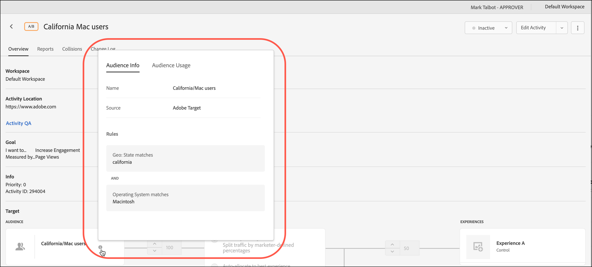
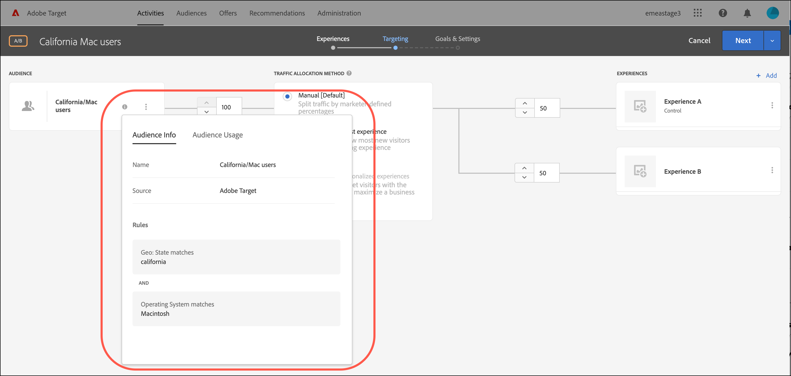

# Create audiences

Audiences in [!DNL Adobe Target] determine who sees content and experiences in a targeted activity.

Audiences are used anywhere targeting is available. When targeting an activity, you have the following options:

* Select a reusable audience from the [!UICONTROL Audiences] list
* [Create an activity-specific audience](/help/main/c-target/creating-activity-only-audience.md) and target it
* [Combine multiple audiences](/help/main/c-target/combining-multiple-audiences.md#concept_A7386F1EA4394BD2AB72399C225981E5) to create an ad hoc audience

You can also use audience data collected by [!DNL Adobe Analytics] for real-time targeting and personalization in [!DNL Target] and other [!DNL Adobe Experience Cloud] applications. See [Experience Cloud Audiences](https://experienceleague.adobe.com/docs/core-services/interface/audiences/audience-library.html) in the *Experience Cloud Central Interface Components* guide.

There are two types of audiences in [!DNL Target]:

* **Targeting audiences:** Used to deliver different content to different types of visitors. 
* **Reporting audiences:** Used to determine how different types of visitors respond to the same content so you can analyze your test results.

  In [!DNL Target], you can configure reporting audiences only if you use [!DNL Target] as your reporting source. If you use [Adobe Analytics as your reporting source](/help/main/c-integrating-target-with-mac/a4t/a4t.md) (A4T), you must configure your reporting audiences within [!DNL Analytics].

## Use the [!UICONTROL Audiences] list {#use-list}

To access the [!UICONTROL Audiences] list, click **[!UICONTROL Audiences]** in the top menu bar:

![[!UICONTROL Audiences] list](assets/audiences_list.png)

The [!UICONTROL Audiences] list contains the audiences that you can use in your activities. Use the [!UICONTROL Audiences] list to create, edit, duplicate, copy, or combine audiences. The list also shows the source where the audience was created:

* [!DNL Adobe Target]
* [!DNL Adobe Target Classic]
* [!DNL Experience Cloud]
* [!DNL Adobe Experience Platform]

  >[!NOTE]
  >
  >The [!DNL Adobe Experience Platform] source is available to all [!DNL Target] customers using the [Adobe Experience Platform Web SDK](https://developer.adobe.com/target/implement/client-side/aep-web-sdk/){target=_blank}. Audiences available from the [!DNL Adobe Experience Platform] can be used as is or [combined with existing audiences](/help/main/c-target/combining-multiple-audiences.md).
  >
  >Users must have [!UICONTROL Approver] or above status in [!DNL Target] to configure [!DNL Target] [!UICONTROL Destinations] cards in AEP/RTCDP ([!DNL Real-time Customer Data Platform]).
  >
  >For more information see [Use audiences from Adobe Experience Platform](#aep).

Predefined audiences, such as "[!UICONTROL New Visitors]" and "[!UICONTROL Returning Visitors]," cannot be renamed.

When working with audiences that were originally created in [!DNL Experience Cloud] or [!DNL Adobe Experience Platform], [!DNL Target] alerts you if you reference an audience in [!DNL Target] activities that have later been deleted in [!DNL Experience Cloud] or [!DNL Adobe Experience Platform].

* If an audience was deleted in [!DNL Experience Cloud] or [!DNL Adobe Experience Platform], a warning icon in both the [!UICONTROL Audience] list and the audience picker displays. A tool-tip in the [!DNL Target] UI also indicates that the audience was deleted in [!DNL Experience Cloud] or [!DNL Adobe Experience Platform]. 
* If you attempt to combine multiple audiences with a deleted audience, or if you attempt to save an activity that references a deleted audience, a warning message displays.

You can also target custom profile parameters and `user.` parameters. When creating an audience, drag the attributes you want to use to target your activity into the audience builder window. If the desired attribute does not display, the attribute has not been fired by an mbox. Other custom mbox parameters are available in the [!UICONTROL Custom Parameters] drop-down list.

Use the [!UICONTROL Filters] button to filter the [!UICONTROL Audiences] list by source: [!DNL Adobe Target], [!DNL Adobe Target Classic], [!DNL Experience Cloud], and [!DNL Adobe Experience Platform].

![Filters option in the [!UICONTROL Audiences] list](assets/filters.png)

Use the [!UICONTROL Search audiences] box to search your [!UICONTROL Audiences] list. You can search for any part of an audience name, or you can enclose a specific string in quotes.

You can sort the [!UICONTROL Audiences] list by audience name or by the date when it was last modified. To sort by name or date, click the column header, then select to display audiences in ascending or descending order.

## View audience definitions {#section_11B9C4A777E14D36BA1E925021945780}

You can view audience definition details on a pop-up card in various places in the [!DNL Target] UI without opening the audience. This functionality applies to audiences created in [!DNL Target Standard/Premium] and audiences imported from [!DNL Target Classic] or created via API.

For example, the following audience definition card is accessed by clicking the [!UICONTROL View Details] icon for the desired audience:

The following audience definition card is accessed by clicking the [!UICONTROL View Details] icon on an activity's [!UICONTROL Overview] page:

The audience definition card shows they audience's type, source, and attributes. Click **[!UICONTROL View full details]** to see other activities that reference that audience, if applicable. If you are viewing an audience definition card from an activity's [!UICONTROL Overview] page, click **[!UICONTROL Audience Usage]**.

The audience usage information can help you avoid accidental impact to other activities while editing audiences. Information includes [!UICONTROL Live Activities], [!UICONTROL Inactive Activities], [!UICONTROL Archived Activities], and [!UICONTROL Syncing Activities]. This feature is available for all audiences (Library audiences and [activity-only audiences](/help/main/c-target/creating-activity-only-audience.md#concept_A6BADCF530ED4AE1852E677FEBE68483)).

If an audience is [combined with another audience](/help/main/c-target/combining-multiple-audiences.md) and the combined audience is used to create an activity, the usage information for both audiences lists that newly created activity.

<!--The following audience definition card is for an audience imported from the Adobe Experience Cloud. In this instance, the audience was imported from Adobe Audience Manager (AAM).

The following details are available for these imported audience types:

| Audience Type | Details |
|--- |--- |
|Mobile audience|Marketing Name, Vendor, and Model. The `matches | does not match` operator displays instead of `equals | does not equal` .|
|Visitor-behavior audience|**user.categoryAffinity:** `categoryAffinity` with `FAVORITE` parameter.  **Monitoring:** Monitoring service equals true. **No Monitoring Service:** Monitoring service equals false. |
|Audiences using the NOT operator|**Single Rule:** Target displays the audience in the format `[All Visitor AND [NOT [rule]`. Single NOT rule displays with AND with `AllVisitor` audience. |

Keep the following points in mind as you work with imported audiences:

* Expression target audiences are no longer supported in Target Standard/Premium. 
* Target Standard/Premium does not support some deprecated audiences or has improved operators for ease of use. Because of this, the definition of an imported audience, although working as per definition, does not mean that same is now available for creation in the Standard/Premium interface. For example, Social Audiences are visible with their rules but Target Standard/Premium does not allow social audiences to be created.-->

## Use audiences from [!DNL Adobe Experience Platform] {#aep}

Using audiences created in [!DNL Adobe Experience Platform] provide richer customer data that leads to more impactful personalization. The [Real-time Customer Data Platform](https://experienceleague.adobe.com/docs/experience-platform/rtcdp/overview.html){target=_blank} (RTCDP), built on [!DNL Adobe Experience Platform], helps companies bring together known and anonymous data from multiple enterprise sources. This process lets you create customer profiles that can be used to provide personalized customer experiences across all channels and devices in real time.
+
By connecting [!DNL Target] to the [!DNL Real-time Customer Data Platform], customers can enrich their web personalization by unlocking new segments that might have been previously inaccessible to [!DNL Target] to enable real-time millisecond personalization on the first page of a customer's web visit. Using audiences and profile attributes created in [!DNL Adobe Experience Platform] lets you expand the available data points for richer personalization. 

This integration unlocks key use cases with Real-time CDP:

* Same-page / Next Hit personalization
* First-time / Unknown users personalization

Key features include:

* Direct Target integration with Real-time CDP/[!DNL Adobe Experience Platform] on the Edge (removing dependency on [!DNL Audience Core services] - AAM)
* [!UICONTROL Target Edge Destinations Card] with governance enforcement
* Real-time CDP Segments and Shared Profile Attributes

Real-time CDP Profile Attribute's feature limitations and considerations:

* Attributes within a given offer must be from the same AEP Sandbox. (In other words, an offer cannot contain attributes from different AEP Sandboxes.)
* Attributes within a given offer may come from different Sources; namely, the Target profile and the AEP profile.(In other words, you can combine attributes whether they come from Target or from the AEP profile.)
* When defining an offer, you may assign default values for Real-time CDP Profile Attributes, in case the attribute does not have an explicit value. For example, if a consent or governance policy blocks the attribute being used in the personalization service, the default value may be used instead.
* When shared, Real-time CDP Profile Attributes are used in the Artificial Intelligence/Machine Learning personalization models for Auto-Target and Automated Personalization.

>[!NOTE]
>
>The Real-time CDP Profile Attributes feature is currently available in Beta for HTML Offers and [JSON Offers](/help/main/c-experiences/c-manage-content/create-json-offer.md).

For more information, see the following topics:

* [Destinations release notes](https://experienceleague.adobe.com/docs/experience-platform/release-notes/latest.html?lang=en#destinations){target=_blank} in the *Adobe Experience Platform release notes*
* [Configure personalization destinations for same-page and next-page personalization](https://experienceleague.adobe.com/docs/experience-platform/destinations/ui/activate/configure-personalization-destinations.html){target=_blank} in the *Destinations overview* guide.
* [Custom personalization connection](https://experienceleague.adobe.com/docs/experience-platform/destinations/catalog/personalization/custom-personalization.html){target=_blank} in the *Destinations overview* guide
* [Adobe Target connection](https://experienceleague.adobe.com/docs/experience-platform/destinations/catalog/personalization/adobe-target-connection.html){target=_blank} in the *Destinations overview* guide
* [Configure personalization destinations for same page and next page personalization use cases](https://www.adobe.com/go/destinations-edge-personalization-en){target=_blank} in the *Destinations overview* guide

### Additional information

Consider the following information when using audiences from [!DNL Adobe Experience Platform]:

#### Personalization use cases

The following table shows which type of personalization use case (next-session or same-page) is available when using the [!DNL Adobe Experience Platform Web SDK] versus using at.js:

|Implementation|Solutions/Use Case Enabled|
| --- | --- |
|at.js|**Solutions**:<ul><li>[!DNL Adobe Audience Manager] (AAM) and [!DNL Target]</li><li>[!DNL RTCDP] (Premium or Ultimate) and [!DNL Target]</li><li>[!DNL RTCDP] (any SKU), [!DNL AAM], and [!DNL Target]</li></ul>**Use Case**:<ul><li>Next-session personalization</li></ul>|
|[!DNL Platform Web SDK] or [!DNL AEP Server-Side API]|**Solutions**:<ul><li>[!DNL RTCDP] (any SKU) and [!DNL Target]</li></ul>**Use case**:<ul><li>Next-session personalization</li><li>Same-page personalization via Edge</li><li>Governance enforced when sharing segments</li></ul>**Solutions**:<ul><li>[!DNL RTCDP] (any SKU), [!DNL AAM], and [!DNL Target]</li></ul>**Use case**:<ul><li>Next-session personalization</li><ul><li>[!DNL AAM] segments</li><li>3rd-party segments via [!DNL AAM]</li></ul><li>Same-page personalization via Edge</li><ul><li>[!DNL RTCDP] segments</li><li>Governance enforced when sharing segments</li></ul>|
|Mix of [!UICONTROL at.js] and [!DNL Platform Web SDK]|**Solutions**:<ul><li>[!DNL RTCDP] (any SKU) and [!DNL Target]</li></ul>**Use case**:<ul><li>Next-session personalization</li><ul><li>For all pages with [!UICONTROL at.js]</li></ul><li>Same-page personalization</li><ul><li>For all pages with [!DNL Platform Web SDK]</li></ul></ul>**Solutions**:<ul><li>[!DNL RTCDP] (any SKU), [!DNL AAM], and [!DNL Target]</li></ul>**Use case**:<ul><li>Next-session personalization</li><ul><li>For all pages with [!UICONTROL at.js]</li><li>[!DNL AAM] segments</li><li>3rd-party segments via [!DNL AAM]</li></ul>|

#### Segment evaluation time

The following table shows the segment evaluation time for events coming from different implementation scenarios:

|Scenario|Edge segment (millisecond evaluation)|Streaming segment (minute evaluation)|Batch segment evaluation|
| --- | --- | --- | --- |
|Events/data from [!DNL Adobe Experience Platform] SDKs|Yes|Yes|N/A|
|Events from [!UICONTROL at.js]|No|Yes|N/A|
|Events from [!DNL Target Mobile] SDKs|No|Yes|N/A|
|Events from batch upload|No|No|Yes|
|Events from offline data (stream)|No|Yes|Yes|

### Video: Next-hit personalization with Real-time CDP and [!DNL Adobe Target]{#RTCDP}

Learn how to personalize on the next hit with [!DNL Real-time Customer Data Platform] and [!DNL Adobe Target]. The [!DNL Adobe Target] destination in [!DNL Real-time CDP] allows you to use [!DNL Experience Platform] segments in [!DNL Adobe Target] for same page and next-page personalization with governance and privacy support.

For more information, see [Next-hit personalization with Real-time CDP and Adobe Target](https://experienceleague.adobe.com/docs/platform-learn/tutorials/experience-cloud/next-hit-personalization.html){target=_blank} in the *Platform Tutorials* guide.

>[!VIDEO](https://video.tv.adobe.com/v/340091?quality=12&learn=on)

### Adobe Target blog and video:

[[!DNL Adobe] announces Same Page Enhanced Personalization with [!DNL Adobe Target] and [!DNL Real-time Customer Data Platform]](https://blog.adobe.com/en/publish/2021/10/05/adobe-announces-same-page-enhanced-personalization-with-adobe-target-real-time-customer-data-platform){target=_blank}

## Training video: Using Audiences 

This video includes information about using audiences.

* Explain the term "audience" 
* Explain the two ways audiences are used for optimization 
* Find audiences in the Audiences List 
* Target an activity to an audience 
* Use audiences for passive reporting in an activity

>[!VIDEO](https://video.tv.adobe.com/v/17398)
