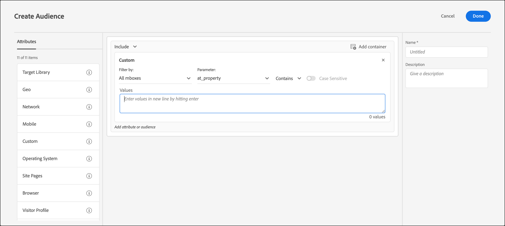

# Custom parameters

Custom parameters are mbox parameters in [!DNL Adobe Target]. If you pass any mbox parameters to mboxes, or use the `targetPageParams` function, those parameters appear here for use in audiences.

For more information, see [Pass parameters to a global mbox](https://developer.adobe.com/target/implement/client-side/atjs/global-mbox/pass-parameters-to-global-mbox/){target=_blank}.

When creating a custom audience based on an mbox parameter, `mboxParameter` no longer prompts you for `mboxName`. The mbox name is now optional. This change lets you use parameters from multiple mboxes or reference a parameter that has not yet been recorded on the edge.

1. In the [!DNL Target] interface, click **[!UICONTROL Audiences]** > **[!UICONTROL Create Audience]**.
1. Name the audience and add an optional description. 
1. Drag and drop **[!UICONTROL Custom]** into the Audience Builder.

   To select the desired parameter:

   * While creating an audience, select a parameter name from the list, start typing the first characters of the desired parameter name, or type the full name of the desired parameter name. 
   * If you remember the mbox name, but not the parameter name, use the [!UICONTROL Filter by] drop-down list to filter on a known mbox passing the desired parameter.

   Using either method, there is no link between the mbox and the parameter. The audience works based on the parameter across all mboxes that pass that parameter.

   If you edit an existing audience, the filtering criteria displays with the mbox name that was supplied during creation.

1. Choose an evaluator:

   * Contains (case insensitive)
   * Does not contain (case insensitive)
   * Equals
   * Does not equal
   * Is greater than
   * Is greater than or equal to
   * Is less than
   * Is less than or equal to
   * Parameter is present
   * Parameter is not present
   * Parameter value is present
   * Parameter value is not present
   * Parameter or value is not present
   * Start with
   * Ends with

   

1. Enter each value in a new line.
1. (Optional) Set up additional rules for the audience.
1. Click **[!UICONTROL Done]**.

The audience's [definition details pop-up card](/help/main/c-target/c-audiences/audiences.md#section_11B9C4A777E14D36BA1E925021945780) shows the parameter name in the **[!UICONTROL Rules]** section. There is no reference to the mbox used for filtering.

>[!NOTE]
>
>For custom audiences created before the [!DNL Target] 18.5.1 release (May, 22, 2018), mbox names do not display in the audience's definition pop-up card. Save the custom audience again to get the mbox name to be shown in the card.

## Considerations {#considerations}

* Audiences and activities are evaluated for a specific mbox. For example, if the global mbox passes a certain parameter, but the regional mbox does not, the activity/audience targeting that parameter is not qualified for on the regional mbox.
* Targeting is not evaluated on internal mbox parameters, such as mboxPC, mboxSession, mbox3rdPartyId, mboxMCSDID, mboxMCAVID, mboxMCGVID, mboxCount, mboxId, and mboxVersion.

## Training video: Creating Audiences 

This video includes information about using audience categories.

* Create audiences 
* Define audience categories

>[!VIDEO](https://video.tv.adobe.com/v/17392)
