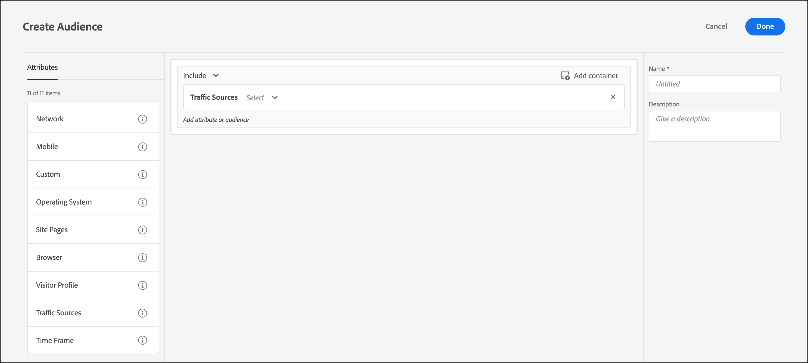

# Traffic Sources

Create audiences in [!DNL Adobe Target] to target visitors based on the search engine or landing page that refers them to your site.

For example, you can target based on the visitor's browser, search engine, or the referring landing page. The referring landing page is the page the visitor clicked from to reach the current site this session. (For example, if the visitor clicked an ad on Google and it leads him or her to the `adobe.com` home page, the referring landing page is `google.com`.)

You can combine multiple traffic sources to create a complex targeting rule.

1. In the [!DNL Target] interface, click **[!UICONTROL Audiences]** > **[!UICONTROL Create Audience]**. 
1. 1. Name the audience and add an optional description. 
1. Drag and drop **[!UICONTROL Traffic Sources]** into the audience builder pane.

   

1. Click **[!UICONTROL Select]**, then select one of the following options:

   * **[!UICONTROL From Baidu]** 
   * **[!UICONTROL From Bing]** 
   * **[!UICONTROL From Google]** 
   * **[!UICONTROL From Yahoo]** 
   * **[!UICONTROL Referring Landing Page: URL]** 
   * **[!UICONTROL Referring Landing Page: Domain]** 
   * **[!UICONTROL Referring Landing Page: Query]**

   Depending on your selection, you might must provide additional information (evaluator and/or values).

1. (Optional) Set up additional rules for the audience. 
1. Click **[!UICONTROL Done]**.

You can target users who are referred to your site by a specific search engine or from a specific landing page.

## Training video: Creating Audiences 

This video includes information about using audience categories.

* Create audiences 
* Define audience categories

>[!VIDEO](https://video.tv.adobe.com/v/17392)
